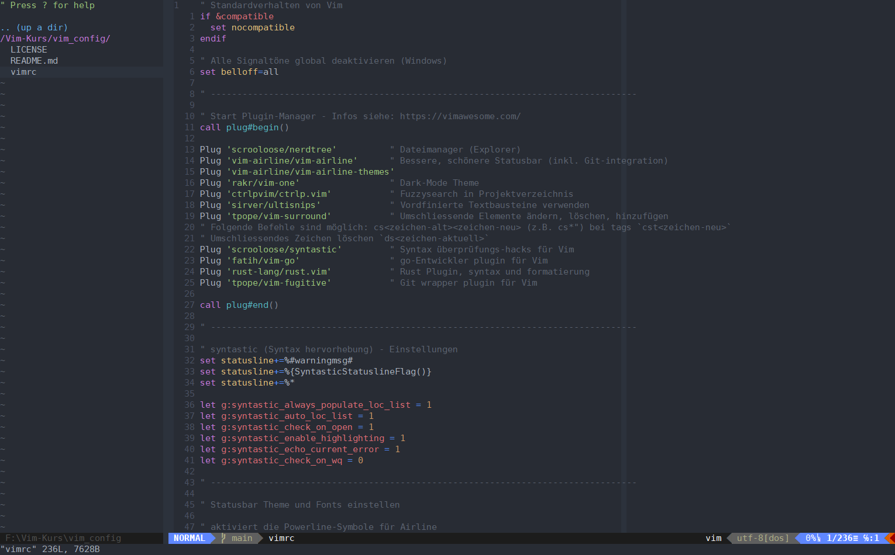

# Vim-gVim-config
<<<<<<< HEAD
---
My little Vim (gVim) config file. I used this one for an online Vim course. So the config file has only some minor adjustments and only some plugins. The config file is optimized to work for gVim on Windows, but it also can be used on Linux and MacOS with some little changes. The comments in the file are mostly in german language, because this is my native language. If there are some wishes, to change or add also english comments, feel free to ask.
## Plugin manager
---
=======
<p align="center">
 
 
 
 
</p>

<p align="center">
  
</p>

My personal little Vim (gVim) config file. Till now the config file has only some minor adjustments and only some plugins. Because I'm new to Vim, the config will change from time to time. At the moment the config file is optimized to work for gVim on Windows, but it also can be used on Linux and MacOS with some little changes. The comments in the file are mostly in german language, because this is my native language. If there are some wishes, to change or add also english comments, feel free to ask.
## Plugin manager
>>>>>>> c5e75225fd6ec60bf4c2191c179a97191bd4560e
To install and activate the plugins in this vim script, I used the plugin manager `plug.vim` from [GitHub](https://github.com/junegunn/vim-plug) - for installation of this plugin manager, please see the [link](https://github.com/junegunn/vim-plug).
> [!NOTE]
> Do not forget to install the plugin manager `plug.vim` or the plugins and installation of them will not work!
> To install the plugins, use the command `:PlugInstall` in Vim (Git **must** also be installed).
## Install / Use 
<<<<<<< HEAD
---
=======
>>>>>>> c5e75225fd6ec60bf4c2191c179a97191bd4560e
To use the `.vimrc`, `_vimrc` file (named here as `vimrc`), it can be downloaded, cloned or copy-pasted. The standard folder for `_vimrc` (Windows) or `.vimrc` (Linux, MacOS) is as follows:

| OS | Filepath |
| :---: | :--- |
| Linux | `~/.vimrc` |
| MacOS | `~/.vimrc` |
| Windows | `C:\Program Files\Vim\_vimrc` |

If you use the file (`.vimrc`, `_vimrc`) for Linux or MacOS, you should delete or change (comment, comment out) the following lines according to your OS (comments in vimscript starting with `" <comment text>`):
```vim
" Activate undo-file and set the path to it
" Set path for the undo-files for Windows
if !isdirectory($USERPROFILE . '/.vim/undo-dir')
    call mkdir($USERPROFILE . '/.vim/undo-dir', 'p', 0700)
endif

set undodir=$USERPROFILE/.vim/undo-dir

" Set path for the undo-files for Linux/MacOS
" if !isdirectory($HOME . '/.vim/undo-dir')
"    call mkdir($HOME . '/.vim/undo-dir', 'p', 0700)
" endif

" set undodir=$HOME/.vim/undo-dir
```

For use on Linux or MacOS you can delete the following lines at the end of the file:
```vim
" Activate full color support for Windows
" set termguicolors

" GUI-Settings (only for gVim for Windows)
if has("gui_running")
    " Hide GUI-elements like scrollbars and menus (optional)
    set guioptions-=m  " hide menubar
    set guioptions-=T  " hide toolbar
    set guioptions-=r  " hide right scrollbar

    " Set font
    set guifont=DejaVu_Sans_Mono_for_Powerline:h11

    " Force window size
    set lines=50
    set columns=170

    " Fix if Windows blocks resizing during rendering:
    " Forces redrawing the window with the desired dimensions
    let &lines=50
    let &columns=170
endif
```
## License
<<<<<<< HEAD
---
=======
>>>>>>> c5e75225fd6ec60bf4c2191c179a97191bd4560e
MIT
